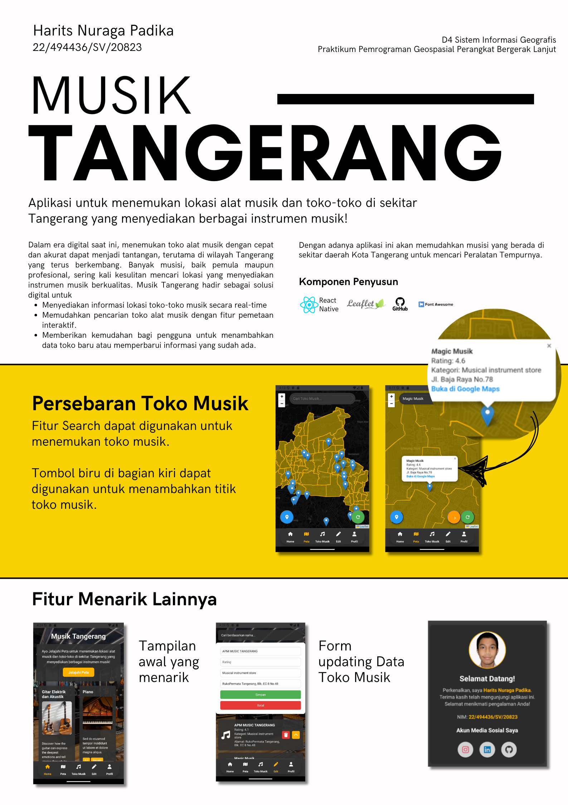

# Musik Tangerang

**Musik Tangerang** adalah aplikasi untuk menemukan lokasi alat musik dan toko-toko instrumen musik di sekitar Tangerang. Aplikasi ini dibuat menggunakan **React Native** dengan fitur pemetaan geospasial yang interaktif.

## 

---

## **Fitur**

1. **Tampilan Awal yang Menarik**

   - Antarmuka yang ramah pengguna dengan navigasi sederhana.  
     

2. **Persebaran Toko Musik**

   - Cari toko alat musik dengan fitur **Search**.

     

   - Tambahkan titik lokasi toko musik menggunakan tombol biru di antarmuka peta.  
     

3. **List Data Toko Musik**

   - Menampilkan Data Toko Musik secara cepat.  
     

4. **Form Update Data**

   - Update atau tambahkan informasi toko musik secara cepat dan praktis.  
     

5. **Profil Pengguna**

   - Menampilkan data pengguna, termasuk nama, NIM, dan media sosial.  
     

---

## **Komponen Penyusun**

Aplikasi ini dikembangkan menggunakan teknologi berikut:

- **[React Native](https://reactnative.dev)** - Framework utama untuk pengembangan aplikasi mobile lintas platform.
- **[Leaflet](https://leafletjs.com/)** - Library peta untuk menampilkan dan mengelola lokasi toko musik.
- **[GitHub](https://github.com/)** - Platform manajemen versi kode sumber dan kolaborasi.
- **[Font Awesome](https://fontawesome.com/)** - Ikon interaktif untuk meningkatkan tampilan UI aplikasi.

---

## **Kredit**

Aplikasi ini dikembangkan oleh:

**Harits Nuraga Padika**  
NIM: 22/494436/SV/20823  
Program Studi: **D4 Sistem Informasi Geografis**  
Praktikum: **Pemrograman Geospasial Perangkat Bergerak Lanjut**

---
